# How to buy 

`(steps: 10, time: 5')`

Buying NFTs may seem confusing at first, but once you learn the basics, it gets simpler. RPS Fam want to make this process as easy and straightforward as possible, so we have created the ultimate step-by-step guide:

1. [Open OpenSea](https://opensea.io/collection/reggaetonpunkstars) in your browser.

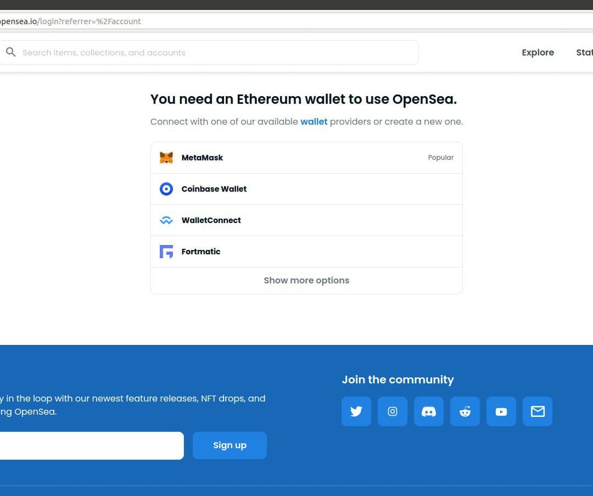
 

2. Choose <b>MetaMask</b>* wallet. 

3. Install MetaMask extension in your browser**. 

4. If you don't have a MetaMask wallet, create one by clicking "Create a Wallet". If you have a previous Wallet, just import it with your secret recovery phrase.

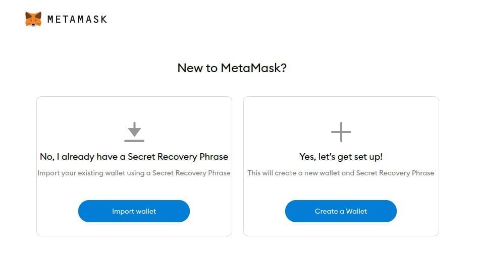
 

5. Follow the MetaMasks steps to create a Wallet. *Remember the secret phrase should be kept securely by the Wallet owner, since it is unique, non-transferable and necessary.*

6. Open [MetaMask](chrome-extension://nkbihfbeogaeaoehlefnkodbefgpgknn/home.html). You'll see the following screen:

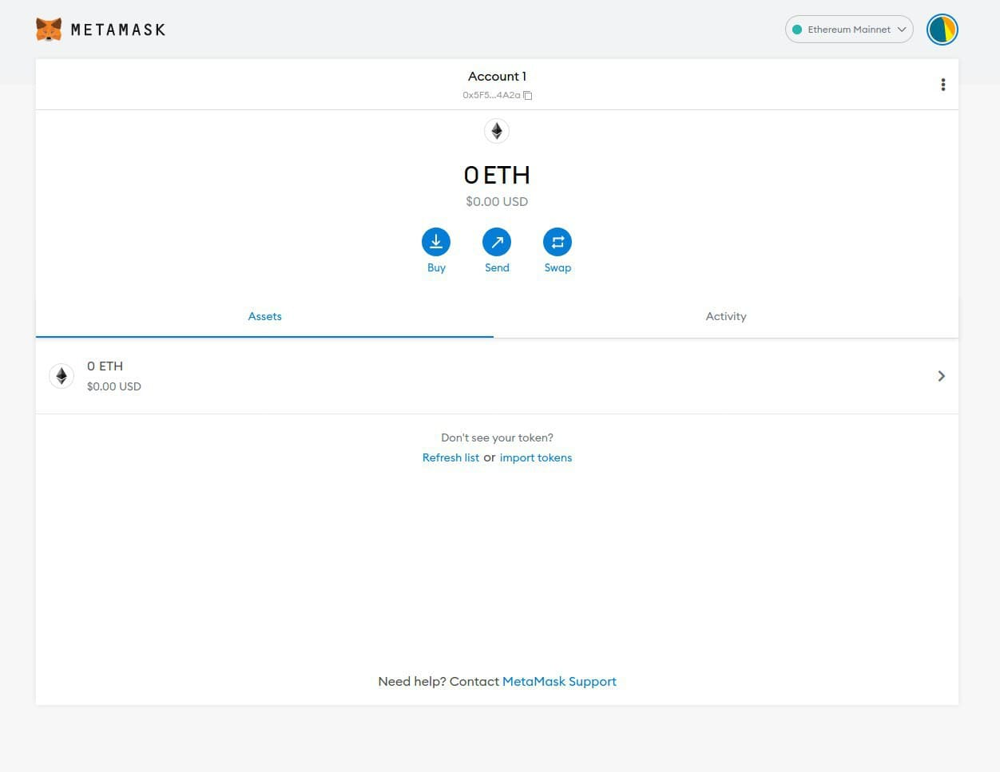
 

7. Now you need to configure your Wallet to use it in the Polygon network***. Click "Ethereum Mainnet" the right upper corner and then click "Add Network".

8. Fill the gaps with the following info and click "Save".

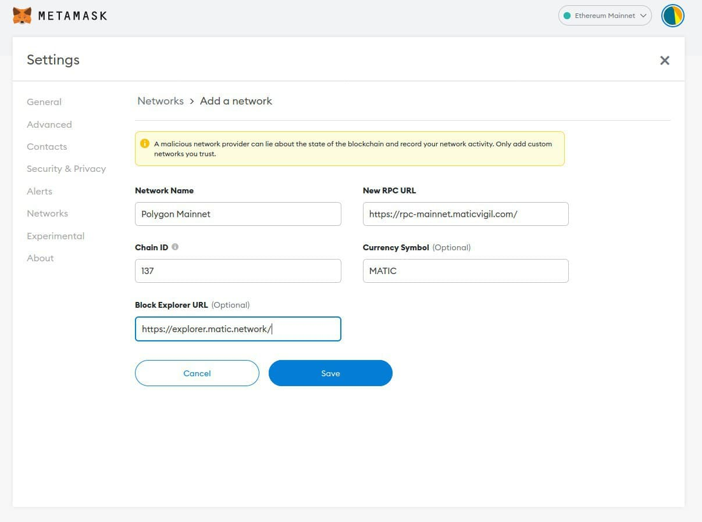
 

9. Choose the recently created "Polygon Mainnet" network in the upper right corner.

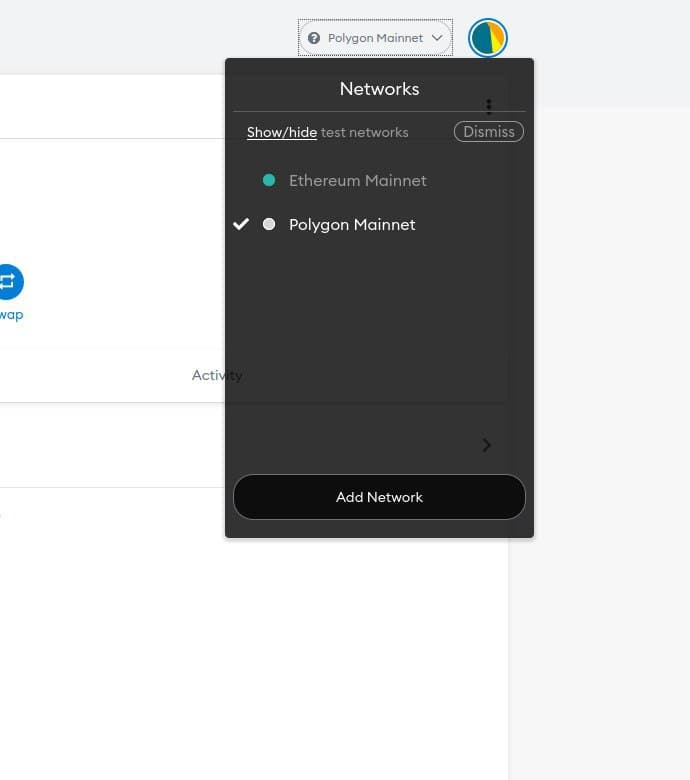
 

10. Go back to [OpenSea](https://opensea.io/collection/reggaetonpunkstars), click the wallet icon in the upper right corner. Then, click "MetaMask" and accept the OpenSea connection with MetaMask.   

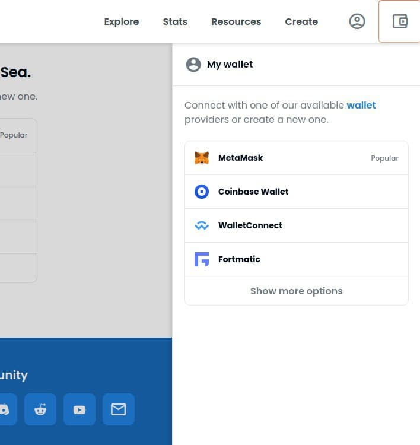
 

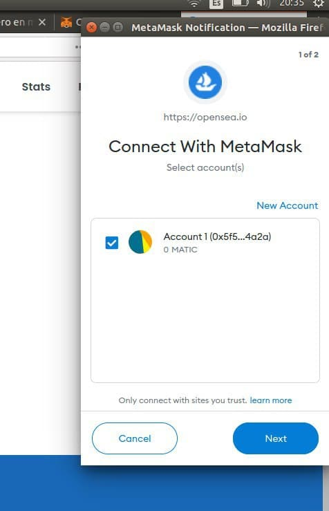
 

Now you can look for your fav [Reggaeton Punks Star](https://opensea.io/collection/reggaetonpunkstars) and purchase it! We have two options to do so:  

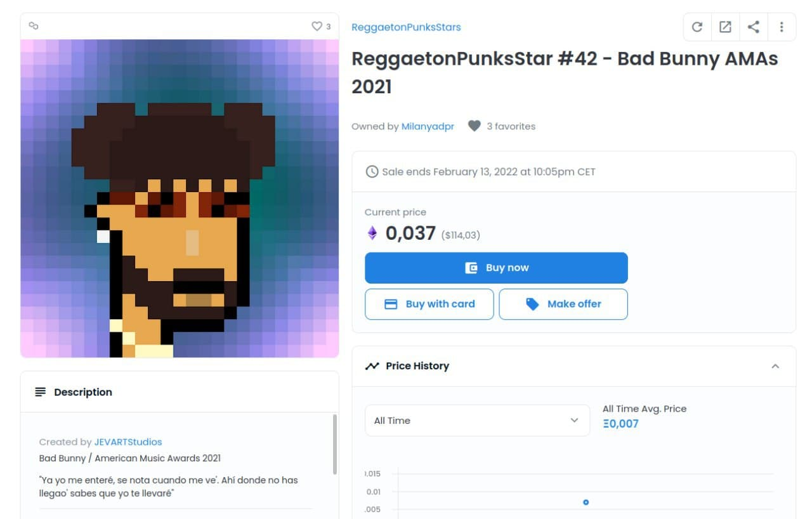
 

## A. BUY WITH CARD (easier & faster if you just want to buy 1 NFT)

"Buy with card" is a quite intuitive method. You just need to follow the steps to turn your usual currency into ETH and get your own Reggaeton Punks Star.  

## B. BUY NOW (recommended if you want to buy more than 1 NFT. Requires an extra step)

You can add funds to your MetaMask Wallet by clicking "ADD FUNDS" in your upper right Wallet icon. 

* <b>IMPORTANT: Choose the ETH - Ethereum (Polygon) cryptocurrency"</b>, since our RPS Collection lives in the Polygon Network.
* Take into consideration GAS fees. You'll probably need to add between 5%-10% more funds than the quantity you want to spend.

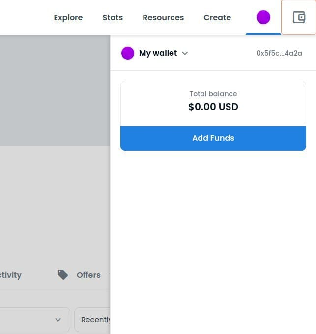
 

 
 

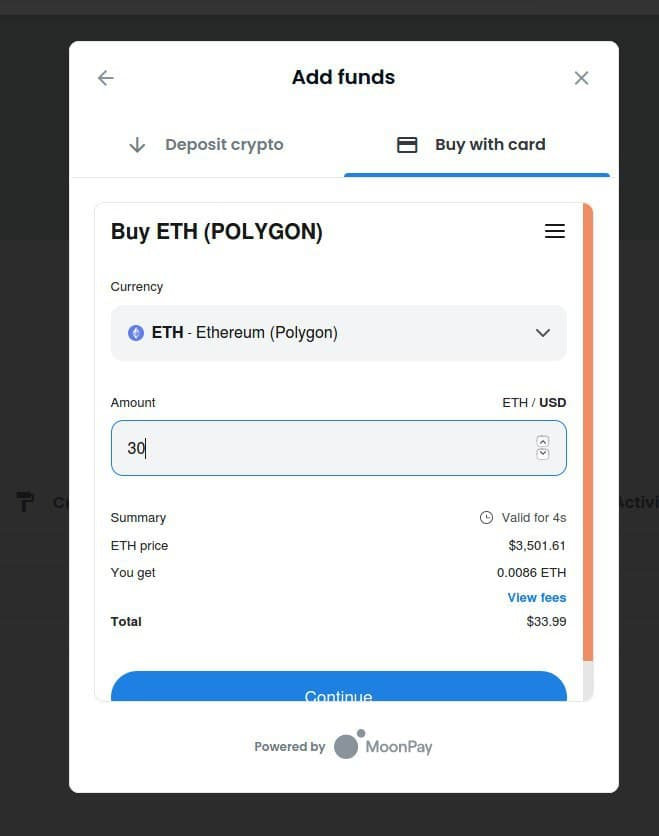
 

After adding funds, the only step left is to click "Buy now" and follow the steps.

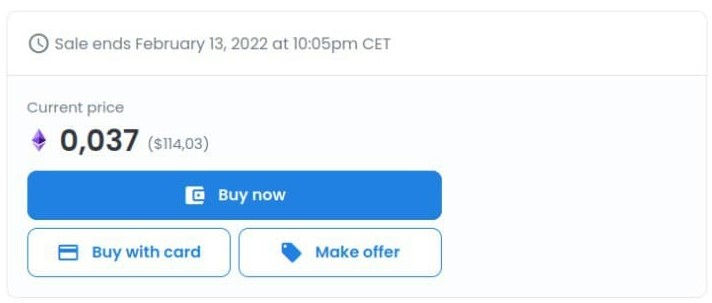
 

### CONGRATS! YOU'VE NOW JOINED THE [RPS FAM](https://reggaetonpunkstarsnft.github.io/fam.html)! 
 

     

\* *MetaMask is a a crypto wallet & gateway to blockchain apps that equips you with a key vault, secure login, token wallet, and token exchange—everything you need to manage your digital assets.*

\** *Once installed, you will find the MetaMask icon in the upper right corner of your browser, otherwise you should be able to find it in the list of our browser extensions (we recommend to pin it in the upper bar).*

\*** *Polygon is a protocol and a framework for building and connecting Ethereum-compatible blockchain networks.*
